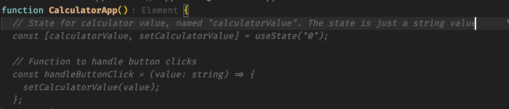
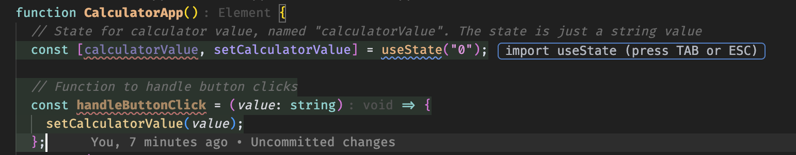
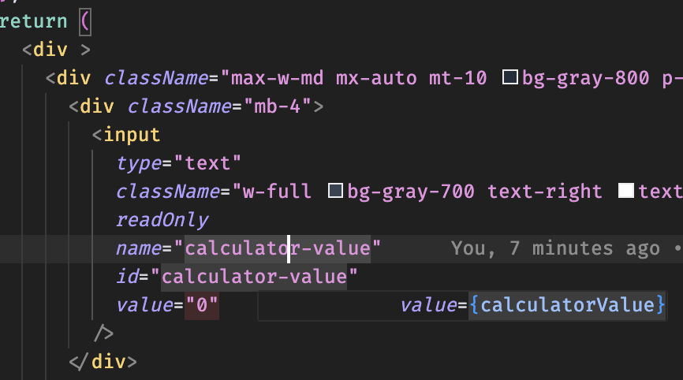
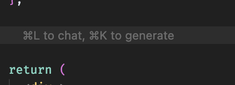
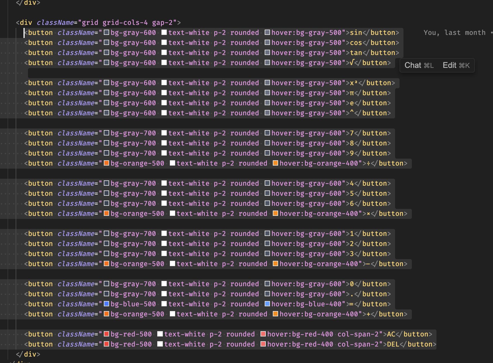

# PART 4 - Cursor

## Introduction

Cursor is an AI Code Editor, which lets you write code using instructions. It has an excellent user interface and can be configured to suit each users' needs. It can generate code (whole files or just snippets) and supports tab-autocomplete, just like GitHub Copilot.

In this folder, you will find a directory named `calculator-app`. It contains a project skeleton for a Calculator application.

## Instructions

- Navigate to `calculator-app` folder
- Open terminal
- Run `npm install` (.nvmrc file assumes you have Node v22 installed, but you can use Node >= 18).
- Run `npm run dev` and you are good to go! 

## Tasks

Your task is to implement a working calculator using the help of Cursor. The following features will be implemented:

- 1) Calculator operation and value stack (= how the calculator does computations)
- 2) Showing the calculator result on the screen
- 3) Click handlers for all the calculator buttons

### First task: Tab autocomplete with Cursor

#### Create calculator state hook

Open `src/App.tsx` and use Cursor's autocomplete ability to create a React hook for the current calculator state (= what is visible on the `calculator-value` input field). The calculator state is just a React hook, that can be used to set and get a string value.

**Instruction:** Copy & paste `// State for calculator value, named "calculatorValue". The state is just a string value.` in the beginning of `CalculatorApp` component (Line 2). What do you observe?

Pressing \[TAB\] on the suggestion creates the new React hook. (Note: It's just not yet attached into anything!)

By writing the prompt as an actual code comment, Cursor suggests you the function code as an autocomplete suggestion. Another way to generate code is to click on the place where you want to generate code and press CMD+K (on Mac) on your keyboard to open the generation chat window. We also instruct cursor to name the React's useState hook as `calculatorValue` and provide a type hint (`string`).

After creating the hook, you should see the following:



After pressing \[TAB\], our code is updated accordingly:



Cursor suggests that you import the `useState` hook from React library. You can press TAB for it to be imported. Cursor also made another suggestion for creating a click handler for a button. Unfortunately, it is not what we want next.

Next, click next to the input value of the element with the ID `calculator-value`. The following suggestion is shown:



Cursor intelligently understands, that we want to show the React hook's value on the read-only input field. Let's accept the suggestion once again by clicking \[TAB\]. 

### Second task: Use the Chat to generate code

#### Create calculator stack functionality

Create a calculator stack hook (= a React hook, which is an array) using Cursor.

To create the stack hook, click somewhere on the code:



Here, the `"CMD+K To Generate"` opens up a chat window where the prompt can be copy-pasted.

Prompt for creating the callback hook:

```
Implement a React callback hook named computeValue, which computes the calculator's current value based on the stack.

The stack includes numbers and symbols, e.g. `+`, `-`, `1` etc..

The calculator works by using postfix/RPN (Reverse Polish Notation) evaluation.
```

Here is the RPN algorithm written in JavaScript: https://rosettacode.org/wiki/Parsing/RPN_calculator_algorithm#JavaScript

Here, the output of Cursor can be different from what is shown in this guide. As LLMs tend to behave non-deterministically based on their configuration, this is completely fine.

#### Create click handlers for each of the buttons

Implement click handlers to each button, so they update the calculator op and value stack (and current state) accordingly. The `=`-button should compute the whole stack (= call the computeValue function).

Prompt:

```
Implement click handler functions for the following:

- Handler, that adds the specified number to the calculator stack (handleNumberClick).
- Handler, that adds the decimal separator to the stack (handleDecimalClick)
- Handler, that adds the specified symbol (+, x, -, division) to the calculator stack (handleOperatorClick).
- Handler, that calls computeValue hook when the `=` button is clicked (handleEqualsClick)
- Handler, that clears the stack and sets the value to "0" when the "AC" button is clicked (handleClearClick)
- Handler, that deletes the item at the current stack, when the "DEL" button is clicked (handleDeleteClick)

Special requirements:

- If a numeric button is pressed multiple times, it should modify the top-most stack item to accommodate for multiple-digit numbers
```

#### Attach the click handlers to the buttons

Highlight every button block in the calculator:



Here, you can already see Cursor's (CMD+K) shortcut for editing the code.

Use the following prompt to attach the event handlers:

```
Attach the correct event handlers to each of the buttons (handleNumberClick, handleDecimalClick, handleOperatorClick, handleEqualsClick, handleClearClick, handleDeleteClick)
```

After this modification, the calculator "should" work. In some cases, Cursor might create a buggy version of the `computeValue` function.

#### Fix bugs using Cursor

You can use Cursor to try and see if it can correct the bugs, by providing it some context, e.g. "When calculating 5 + 5 and pressing Equals, I'm presented with an error. Help me debug the issue.". For instance, you might observe the following issues:

- Clicking a single number multiple times does not show e.g. 313
- Clicking "=" does absolutely nothing
- Clicking "=" shows "ERROR" and the computation is not working.
- The UI does not update as expected.

#### Conclusions

The end! In this part, we created a functional (hopefully almost working) calculator app using Cursor's autocomplete and chat functionality. Don't worry if you didn't manage to create a working one -- it takes time to perfect the prompts. Also - as the calculator uses the RPM algorithm, the LLM can get that part wrong. Fortunately, Cursor provides an intuitive way of diagnosing and correcting bugs.