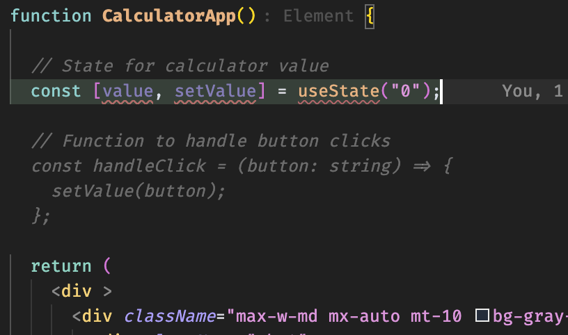

# PART 4 - Cursor

## Introduction

Cursor is an AI Code Editor, which lets you write code using instructions. It has an excellent user interface and can be configured to suit each users' needs. It can generate code (whole files or just snippets) and supports tab-autocomplete, just like GitHub Copilot.

In this folder, you will find a directory named `calculator-app`. It contains a project skeleton for a Calculator application.

## Instructions

- Navigate to `calculator-app` folder
- Open terminal
- Run `npm install` (.nvmrc file assumes you have Node v22 installed, but you can use Node >= 18).
- Run `npm run dev` and you are good to go! 

## Tasks

Your task is to implement a calculator using the help of Cursor. We will implement the following features:

- Calculator operation and value stack (= how the calculator does computations)
- Showing the calculator result on the screen
- Click handlers for all the calculator buttons

### First task: Tab autocomplete

#### Create calculator state hook

Open `App.tsx` and use Cursor's autocomplete ability to create a React hook for the current calculator state (= what is visible on the `calculator-value` input field)

**Instruction:** Write `// State for calculator value` just in the beginning of `CalculatorApp` component. What do you observe?

Pressing \[TAB\] on the suggestion creates the new React hook. (Note: It's just not yet attached into anything!)

By writing the prompt as an actual code comment makes Cursor suggest you the function code as an autocomplete suggestion. Another way to generate code is to click on the place where you want to generate code and press CMD+K (Mac) on your keyboard to open the generation chat window.

After creating the hook, you should see the following:


After pressing \[TAB\], our code is updated accordingly:



Whoa! Cursor made another suggestion for creating a click handler for a button. Unfortunately, it is not what we want next.

Next, click next to the input value of the element with the ID `calculator-value`. The following suggestion is shown:


Cursor intelligently understands, that we want to show the React hook's value on the read-only input field. Let's accept the suggestion once again by clicking \[TAB\].

### Second task: Use the Chat to generate code

#### Create calculator stack functionality

Create a calculator stack hook (= a React hook, which is an array) using Cursor.

To create the stack hook, click somewhere on the code:


Here, the `"CMD+K To Generate"` opens up a chat window where the prompt can be copy-pasted.

Prompt for creating the function:

```
Implement a React callback hook named computeValue, which computes the calculator's current value based on the stack.

The stack includes numbers and symbols.

The calculator works by using postfix/RPN (Reverse Polish Notation) evaluation.
```

#### Create click handlers for each of the buttons

Implement click handlers to each button, so they update the calculator op and value stack (and current state) accordingly. The `=`-button should compute the whole stack (= call the computeValue function).

Prompt:

```
Implement click handler functions for the following:

- Handler, that adds the specified number to the calculator stack.
- Handler, that calls computeValue hook when the `=` button is clicked
- Handler, that clears the stack and sets the value to "0" when the "AC" button is clicked
- Handler, that deletes the item at the current stack, when the "DEL" button is clicked

Special requirements:

- If a numeric button is pressed multiple times, it should modify the top-most stack item to accommodate for multiple-digit numbers
```

While at it, test out the calculator between generated code to check if the feature works as it should.  Don't worry if you notice any bugs - we will fix them in the next part.

#### Fix bugs using Cursor

You might notice, that the calculator application is not working as expected. You might have observed the following issues:

- Clicking a single number multiple times does not show e.g. 313
- Clicking "=" does absolutely nothing
- The UI does not update as expected.

Cursor is very handy at finding and fixing bugs. Try to describe some of the bugs mentioned above to see, what kind of fixes it suggests for you.